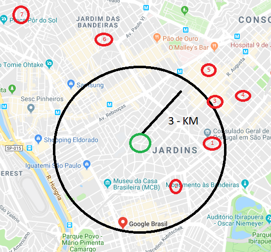

# who-next
API em JS para informar quem está proximo de você em REAL-TIME
API in JS get nearbly users



```js
let users = [
    {
        id: 1,
        name: 'João',
        // Google Maps
        lat  : -23.9789580,
        lng  : -46.3121512,
    }, 
    {
        id: 2,
        name: 'Vitor',        
        lat  : -23.9772151,distance
        lng  : -46.3082780,
    }, 
    {
        id: 3,
        name: 'Murillo',        
        lat  : -23.9581367,
        lng  : -46.3925527,
    },
    {
        id: 4,
        name: 'DEXTERpy',        
        lat  : -23.9614568,
        lng  : -46.3247244,
    },
    {
        id: 5,
        name: 'Celso',        
        lat  : -23.9739162,
        lng  : -46.3122721,
    },
    {
        id: 6,
        name: 'Darezzo',
        lat  :-23.9366827,
        lng  :-46.3882702,
    },
];
```  

Fórmula matemática de [Haversine](https://pt.wikipedia.org/wiki/F%C3%B3rmula_de_Haversine) (esfera da terra)


```sql
create database imasters;

use imasters;

CREATE TABLE pessoa (
	 id int(8) auto_increment primary key
	,nome  varchar(50)
	,lat float(9,6) NOT NULL
	,lng float(9,6) NOT NULL
);

INSERT INTO pessoa (nome, lat, lng) VALUE 
('Vit', -23.9789580, -46.3121512)
,('Rafa', -23.9772151, -46.3082780)
,('João', -23.9581367, -46.3925527)
,('Rodrigo', -23.9366827, -46.3882702)
,('Celso', -23.9739162, -46.3122721)
,('allex', -23.9614568, -46.3247244);

/*
-- Rafa
-23.9772151
-46.3082780
*/

SELECT
 (((acos(sin((-23.9772151*pi()/180)) * sin((`lat`*pi()/180))+cos((-23.9772151*pi()/180))  * cos((`lat`*pi()/180)) * cos(((-46.3082780- `lng`)*pi()/180))))*180/pi())*60*1.1515*1.609344) as distance
,nome
FROM pessoa
WHERE distance <= 10 -- KM
order by distance
;

/*
-- Result: 
 
+------------------------+---------+
| distance               | nome    |
+------------------------+---------+
| 0.00013425232662457948 | Rafa    |
|    0.43878413150349677 | Vit     |
|     0.5470051287699728 | Celso   |
|     2.4210902068465825 | allex   |
|      8.821210177019271 | João    |
|       9.29394275935523 | Rodrigo |
+------------------------+---------+
6 rows in set (0.00 sec)

*/
```` 
